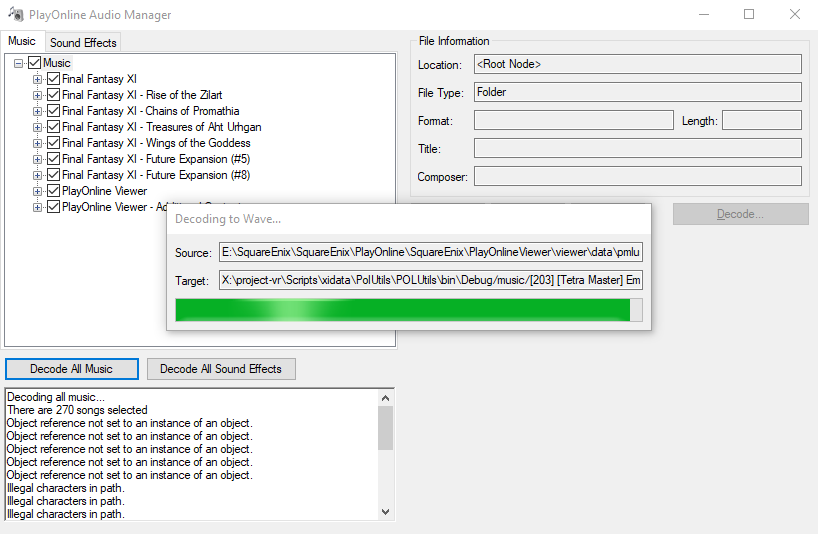

# PolUtils

Original Code: https://github.com/Windower/POLUtils

I have modified the Audio Manager to include batch export buttons for both Music and Sound Effects

Run: bin > debug > POLUtils.exe

Todo - it bugs out on tetra master, you can click continue, need to catch this exception...